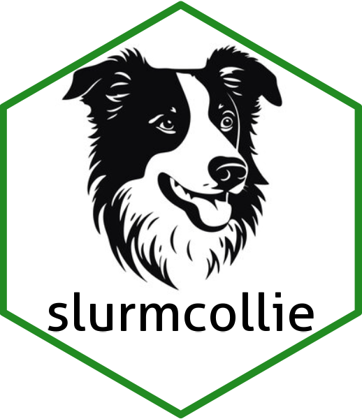

# slurmcollie <a href="https://github.com/UMassCDS/slurmcollie/"></a>

A lightweight border collie eager to herd your R Slurm jobs

## What is slurmcollie? 
A simple Slurm job manager for R, `slurmcollie` makes it easy to launch R code as Slurm jobs. It 
manages many heterogeneous runs, tracking run status, errors, logs, and run statistics such as memory and 
CPU used. Instead of mucking around in the depths of Slurm, you should be able to get R jobs running 
within an hour of reading this.

`slurmcollie` is a front end for the [batchtools](https://github.com/mlr-org/batchtools) package,
which is a front end for [Slurm](https://slurm.schedmd.com/overview.html) [^1]. `batchtools` has 64
user-facing functions, while Slurm has more commands and options than there are stars in the sky.
`slurmcollie`, on the other hand, has 5 primary user-facing functions, including the set up function you'll
likely only run once.

`slurmcollie`'s focus is on simplicity. You don't need to know the details of job scheduling nor
write elaborate wrappers for your functions. You won't (usually) need to mess with hairy
configuration files. You'll need to learn four function names: `launch()`, `info()`, `kill()`, and
`purge()`. That should leave plenty of space in your brain to get your work done.

`slurmcollie` has the following attributes:

- It **tracks large numbers of heterogeneous jobs**. You can repeatedly launch what you want, when you want, and
check in with `info()` any time to see how your jobs are doing.

- It is **passive**. It has no agent tracking your jobs--it reacts to your commands. When you want to 
launch batch jobs, it'll do that quickly and get out of your way. When you wonder whether your jobs 
are done, you'll call info, and the jobs database will be updated behind the scenes--that's why 
``info()`` sometimes takes a second or two before responding.

- It is **single-user**. It saves the jobs database (an .RDS file) after updates, so
it should be crash-proof and interrupt-proof. But only one user can use the same `slurmcollie` home
directory. If multiple people are working on the same project, they should use different
`slurmcollie` home directories (for instance, in /home) to avoid disaster.

-  It gives you the **information you need to use cluster resources efficiently**. It's bad practice 
to request 500 GB of RAM when you only need 20 GB, or 20 CPUs when you're just using 2. `info()` gives 
you stats for completed jobs so you can tailor the resources requested for future jobs more effectively.

- It **plays nicely** with other uses of its home directory, allowing it to also be used
to store separate databases used by the calling code. It cleans up after itself, deleting
`batchtools` registries when all jobs are completed and and accounted for.

- It **saves the logs** for all runs until you purge the jobs from the `slurmcollie` database, so you 
can view the full output of your runs, including debugging messages and errors.

- It supports **local runs**. Though it is intended to spawn batch jobs on other computers and return 
console control to you immediately, you can include `local = TRUE` in a launch call to run a job 
locally while you wait. This can be useful for debugging, assessing memory needs, or when you 
want to run code on your local computer rather than on Unity. In local mode, most messages and run 
statistics are gathered as for batch jobs, and saved to the jobs database after each rep.

- You can specify a **finishing function** at launch. This function will be passed the job id and job 
status when `info()` reports the job as done (successfully or not). Finishing functions are intended 
to update databases in the calling code. They should run quickly, as you'll have to wait for it on an 
`info()` call.

- There is **no support for job dependencies**: you can't for example, ask it to run job x once jobs 
a, b, and c are done. 

## Who is slurmcollie for? 
`slurmcollie` is designed to work on the [Unity
cluster](https://docs.unity.rc.umass.edu/) (a collaborative high-performance computing cluster run
by the University of Massachusetts, University of Rhode Island, and others). It will probably work
on other Linux clusters using Slurm, but you'll be on your own.

It is designed for those who want to do task-level parallelization of R code with a minimum of
effort. The [canonical example](https://github.com/UMass-UAS-Salt-Marsh/salt-marsh-mapping) 
(for which it was designed), is fitting several hundred random forest
models over a period of weeks. Each fit takes a while (typically tens of minutes), so
launch-wait-launch-wait would be an excruciating workflow. `slurmcollie` allows launching model fits
as fast as you can define them, either as single-fit jobs or as reps over, say, a vector of formula
objects. It tracks the status and statistics of fits over many rounds of launching.

## What do you need to bring?

- You'll need to bring one or more R functions that you want to run in batch mode (thus they can't 
interact with the console).
- Your functions can take any number of arguments. If you want to run multiple reps in a single 
launch, one or more arguments should distinguish reps (unless you just want to do the same thing 
over and over, presumably with randomization). See `help(launch)` for 
details on how to pass arguments.
- Your functions should not return values, as these will be printed in the log files but not 
otherwise captured. Your code must provide side-effects, typically by writing to files.
- Your functions must use `library()` or package mechanisms to attach any needed packages, which should 
be installed before launching.
- You may provide an optional finishing function at launch, to be run after each jobs done, 
triggered by `info()`. This is intended to support updating databases in the calling code.

## Installing `slurmcollie`

### 1. Set up ssh connection to Unity login node 

This painful process only needs to be done once. It
is necessary for automated submission of `sbatch` jobs to Unity from within R, when R is running on a
compute node (e.g., in RStudio onDemand)

First, you'll need to [set up the SSH keys](https://www.redhat.com/sysadmin/passwordless-ssh).
Open up a [Unity terminal
window](https://ood.unity.rc.umass.edu/pun/sys/shell/ssh/login-node-round-robin.unity.rc.umass.edu).
Note the login node in the prompt, immediately after your user name (e.g.,
`some_dude_umass_edu@login1:~$`). If this is `login1`, you can skip this step; otherwise, type

```
ssh login1
```

to get to `login1`. (Alternatively, you can use a different login node, but sticking with login1 is
simpler.)

You might be able to re-use an existing SSH key if you already did this but it's best to use a new
one unless you were using it for a similar purpose. Check for existing keys:

```
ls -l ~/.ssh
```

To create a new key, enter this command and hit enter. Hit enter again when asked if you want to
create a passphrase. It's easier if you don't use one, and this is all occurring within Unity and
within your home directory, which is already fairly secure, but your mileage may vary.

```
ssh-keygen
```

This creates a public/private key pair in your home directory on Unity. Your home directory is on a
network file system that is accessible from all Unity login and compute nodes.
Next, create a shortcut to SSH into Unity more easily:

Add the following to the file `~/.ssh/config`, removing all angle brackets:

```
Host login1
HostName login1.unity.rc.umass.edu
User <yourusername_umass_edu>
IdentityFile ~/.ssh/<your_unity_private_key_filename_created_in_last_step>
```

Now, copy over the SSH public key to the server with the following command, removing all angle
brackets. You'll need to customize the command if you were not using the default key name.
```
ssh-copy-id <yourusername_umass_edu>@login1
```
Now, try SSHing into the login node from a compute node. First, get a command line on a compute node
by entering this on a login node terminal:

```
salloc -c 2 -p cpu
```

The terminal prompt should change and show that you are on a compute node. Now, try SSHing back into
the login node. If you are asked whether to want to add the server to known hosts, type `yes` and
hit enter.

```
ssh login1
```

You might need to enter your Unity password the first time. If your prompt now changes again to say
you're on the login node, it means your compute nodes should now be able to submit jobs to the login
node in an automated fashion, with keys only and no passwords required.

### 2. Set up a container for R 
If you're using RStudio onDemand, you'll need to include the following in the `Override Rstudio
image location` field on the launching page:

```
/modules/admin-resources/ood-dev/unity-r_4.4.0.sif
```

Now you can launch R. You can do one more test of your ssh connection from R if you want:

```
system('ssh login1)
```

You should get an error message (`Pseudo-terminal will not be allocated because stdin is not a
terminal`) and a Unity login banner. If so, you should be good to go.

### 3. Install slurmcollie

```
# install.packages("devtools")
devtools::install_github("UMassCDS/slurmcollie")
```

### 4. Set up slurmcollie directories and files 
You'll need to do this once after installation. You'll need to know two things: 

1. Pick a
`slurmcollie` **base directory**. This is where it will store various files it needs, most of which you
won't need to worry about. The exceptions are if you want to change default Slurm configuration or
if you want to look at log files. This directory may be shared with other uses, such as databases
for the calling code. **It must not be shared with other users**, as `slurmcollie` has a single-user
database, and concurrent access to the database will corrupt it. 

2. You'll need the name of the **login node**, from Step 1 above. Run the following, substituting 
your base directory and the login node if it's different.

```
set_up_slurmcollie(dir = 'my/base/directory', login_node = 'login1')
```

Two configuration files will be copied to `templates` within your base directory. You may need to
modify these, if, for instance you need to call GPUs, or if you're using a cluster other than Unity.

1. `batchtools.conf.R` sets the default resources for runs. You can override these resources in each
`launch()` call, but it'll be easier to set commonly-used resources here. 

2. `slurm.tmpl` is a Bash script that provides the interface between `batchtools` and Slurm. If 
fortune smiles on you, you won't even need to look at it. You can add some ~~cool~~ annoying things 
like requesting an email when a job finishes.

The other potentially interesting directory is `logs` in your base directory. This will contain a
log for each of your `slurmcollie` jobs once it's finished and been checked in with a call to
`info()`. The job id is included in the file name. These can be invaluable for debugging.

## Usage 

Here's a simple run-through of `slurmcollie`. You can find details in the help for each of
these functions.

First, we launch 3 reps of `batch_test()` and call `info()` immediately. The jobs are still queued
by Slurm when we call info.

```
> launch('batch_test', reps = 1:5, comment = 'Five reps of batch_test')
5 jobs (jobids 1, 2, 3, 4, 5) submitted to reg001
> info()
5 jobs not done

  status jobs
 pending    5

 jobid  status error message cores mem_gb walltime cpu cpu_pct                 comment
     1 pending                  NA     NA                      Five reps of batch_test
     2 pending                  NA     NA                      Five reps of batch_test
     3 pending                  NA     NA                      Five reps of batch_test
     4 pending                  NA     NA                      Five reps of batch_test
     5 pending                  NA     NA                      Five reps of batch_test
> 
```

We realize that we don't really want to run the 3rd rep, so we kill it:

```
> kill(3)
Killed 1 jobs (jobs 3)
```

Note that if you wait too long here, the job may have finished before you kill it.
Let's wait a little while for the jobs to launch and call `info()` again. Note that jobs may sit in
the queue for varying lengths of time, depending on how busy the cluster is.

```
> info()
3 jobs not done

  status jobs
 running    3
   error    1
  killed    1

 jobid  status error        message cores mem_gb walltime      cpu cpu_pct                 comment
     1 running                         NA     NA                           Five reps of batch_test
     2   error  TRUE We hate job #2     1  0.002 00:00:03 00:00:02   66.67 Five reps of batch_test
     3  killed                         NA     NA                           Five reps of batch_test
     4 running                         NA     NA                           Five reps of batch_test
     5 running                         NA     NA                           Five reps of batch_test
```

Now jobs are running. Note that we got an error on job #2. That's because batch_test throws an error
by design for job #2.

Now we'll launch a different job, one that will take longer. This job doesn't have any reps.

```
> launch('big_test', comment = 'this will take longer')
1 job (jobid 6) submitted to reg002
> info()
1 job not done

   status jobs
  running    1
 finished    3
    error    1
   killed    1

 jobid   status error        message cores mem_gb walltime      cpu cpu_pct                 comment
     1 finished FALSE                    1  0.009 00:00:16 00:00:02    12.5 Five reps of batch_test
     2    error  TRUE We hate job #2     1  0.015 00:00:04 00:00:02      50 Five reps of batch_test
     3   killed                         NA     NA                           Five reps of batch_test
     4 finished FALSE                    1  0.140 00:01:00 00:00:02    3.33 Five reps of batch_test
     5 finished FALSE                    1  0.141 00:00:50 00:00:02       4 Five reps of batch_test
     6  running                         NA     NA                             this will take longer
```

We now see the final status for most of the jobs: jobs #1, 4, and 5 finished without error. Job #2 threw an
error, and we killed job #3. Job 6 is still running. The finished jobs have now reported statistics:
how many cores they used, memory used, the total runtime ("walltime"), CPU time, and percent
utilization of the CPU. There are several other fields available from info, but these are usually
what you want to see.

When we're all done, we can purge the completed jobs from the database. This will remove the
`batchtools` registries and log files, as well as these rows from the database. If you want to keep
this information longer-term, it's good practice to write a finishing function to capture them.

```
> purge(list(done = TRUE))
Purged 5 jobs
> info()
1 job not done

  status jobs
 running    1

 jobid  status error message cores mem_gb walltime cpu cpu_pct               comment
     6 running                  NA     NA                      this will take longer
```

## Support 
If you run into trouble, please try to determine whether the problem is related to the R
code in `slurmcollie` (if so, [file an issue](https://github.com/UMassCDS/slurmcollie/issues)) 
or with Slurm or Unity (in which case, contact [Unity](https://docs.unity.rc.umass.edu/contact/)).
If you're using a cluster other than Unity, the system's administrators may be able to help you. We have 
limited ability to support users, but will attempt to fix all package bugs promptly. We'll also entertain 
suggestions for improvements and extensions, though we want to stick to the package's goal of simplicity.

[^1]: `batchtools` works with several batch schedulers including Slurm, but `slurmcollie` is
Slurm-specific.